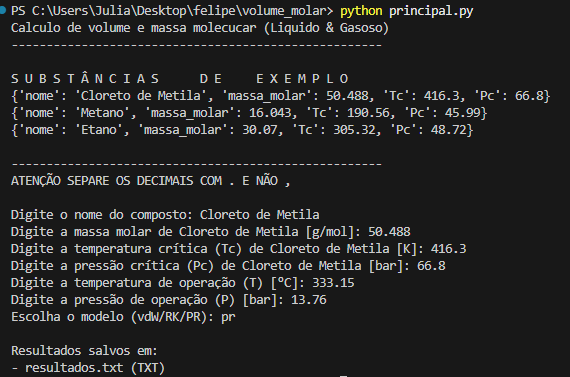
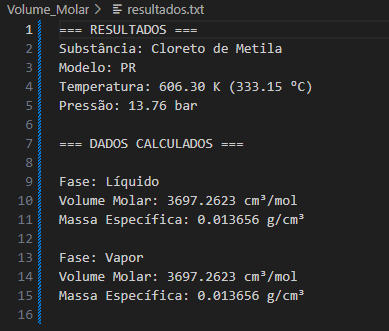
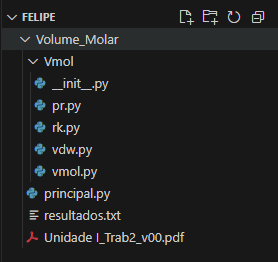

# Projeto: Cálculo de Massa Específica de Substâncias Puras

Este projeto implementa um programa computacional para o cálculo do volume molar e da massa específica de substâncias puras, utilizando diferentes modelos termodinâmicos cúbicos (van der Waals, Redlich-Kwong e Peng-Robinson).

-----

## 👨‍💻 Sobre o Autor

  * **Nome:** Felipe Tourinho Argôlo Aleluia
  * **Disciplina:** ENGD01 – Métodos Computacionais na Engenharia
  * **Professor:** Yuri Guerrieri
  * **Universidade:** Universidade Federal da Bahia - Escola Politécnica - Departamento de Engenharia Química

-----

## 🎯 Objetivo do Projeto
O objetivo principal deste programa é determinar o **volume molar** e a **massa específica** de substâncias puras em condições específicas de temperatura e pressão. Ele utiliza a **Equação 1** fornecida no enunciado para um cálculo iterativo de ponto fixo, aplicando os parâmetros `a` e `b` específicos para cada modelo termodinâmico escolhido



-----


## 📂 Estrutura do Projeto

O projeto é organizado da seguinte forma para facilitar a modularidade e a manutenção:

```
.
├── principal.py
└── Vmol/
    ├── __init__.py    (Arquivo vazio que indica que 'Vmol' é um pacote Python)
    ├── vmol.py        (Contém a função principal Vmol que orquestra o cálculo do volume molar iterativo)
    ├── pr.py          (Contém a função para gerar os parâmetros 'a' e 'b' do modelo Peng-Robinson)
    ├── rk.py          (Contém a função para gerar os parâmetros 'a' e 'b' do modelo Redlich-Kwong)
    └── vdw.py         (Contém a função para gerar os parâmetros 'a' e 'b' do modelo van der Waals)
```

-----

## 🚀 Como Rodar o Código

Este código foi desenvolvido em **Python** e pode ser executado em qualquer ambiente que tenha o interpretador Python instalado.

### 1\. Requisitos de Software

  * **Python:** É necessário ter o **Python versão 3.x** instalado. Recomenda-se a versão **Python 3.10** ou superior para compatibilidade total com as sintaxes mais recentes.

      * **Como instalar Python:**
        1.  Acesse o site oficial do Python: [python.org/downloads](https://www.python.org/downloads/)
        2.  Baixe o instalador mais recente para o seu sistema operacional (Windows, macOS, Linux).
        3.  Execute o instalador. **É CRÍTICO marcar a opção "Add Python to PATH"** (Adicionar Python ao PATH) durante a instalação no Windows, para que o comando `python` funcione no terminal. Para macOS/Linux, geralmente já é configurado.
        4.  Para verificar a instalação, abra um terminal (Prompt de Comando no Windows, Terminal no macOS/Linux) e digite:
            ```bash
            python --version
            ```
            Você deve ver a versão instalada (ex: `Python 3.10.x`).

  * **Editor de Texto/IDE (Recomendado):** Recomenda-se o uso do **Visual Studio Code (VS Code)** para uma melhor experiência de desenvolvimento, depuração e organização do projeto.

      * **Como instalar VS Code:**
        1.  Acesse o site oficial do VS Code: [code.visualstudio.com](https://code.visualstudio.com/)
        2.  Baixe e instale a versão para o seu sistema operacional.
        3.  Após a instalação, abra o VS Code e instale a extensão "Python" (da Microsoft) para obter recursos úteis para desenvolvimento Python.

### 2\. Configuração do Projeto

1.  **Baixe os arquivos:** Faça o download de todos os arquivos do projeto (`principal.py` e a pasta `Vmol` com seus conteúdos).
2.  **Organize os arquivos:** Certifique-se de que a estrutura de pastas seja exatamente como mostrado acima (`principal.py` no diretório raiz e a pasta `Vmol` contendo os módulos de funções).
3.  **Verifique `__init__.py`:** Dentro da pasta `Vmol`, deve haver um arquivo vazio chamado `__init__.py`. Se ele não estiver presente, crie-o. Isso é fundamental para que o Python reconheça `Vmol` como um pacote.

### 3\. Executando o Programa

1.  Abra o terminal (Prompt de Comando, PowerShell, Git Bash no Windows; Terminal no macOS/Linux) ou o terminal integrado do VS Code.
2.  Navegue até o diretório onde você salvou o arquivo a pasta do proejto. Por exemplo, se você salvou em `C:\desktop\volume_molar`, digite:
    ```bash
    cd C:\desktop\volume_molar
    ```
3.  Para rodar o programa, execute o seguinte comando:
    ```bash
    python principal.py
    ```
4.  O programa começará a solicitar as informações da substância (nome, massa molar, propriedades críticas) e as condições de operação (temperatura, pressão), além do modelo termodinâmico a ser utilizado. Siga as instruções no terminal.
5.  Após os cálculos, os resultados serão exibidos no terminal e salvos em um arquivo de texto (`.txt`) no mesmo diretório chamado resultados.txt
